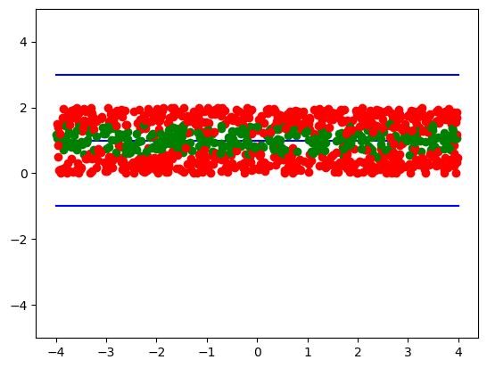
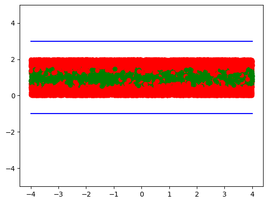
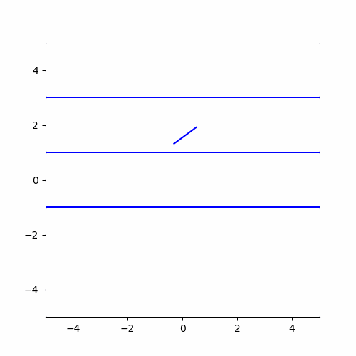
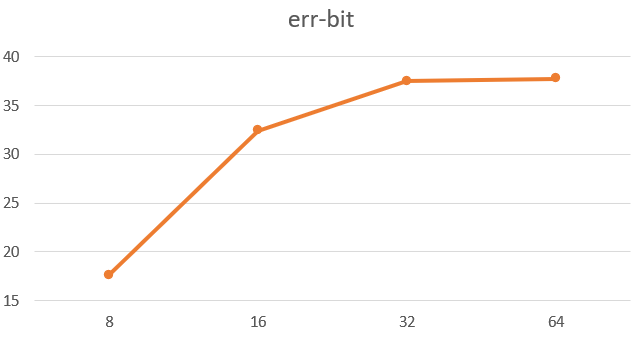

# MC-Integral-Buffon-Needle
## About
This repo includes my python & C code of Boffon's Needle simulation. This is a Monte Carlo method of calculating $\pi$. The detailed report is in `report-ch.pdf`. Actually this is an assignment of Probability Theory and Stochastic Process.
I not only calculated $\pi$ with MC, but also analyze the factor that may influence the error, including number of simulations and data type (fp4/fp8/fp16/fp32/fp64). 
## Results
Green: needles that cross the central line
Red needles dropped elsewhere

(Up: 1000 needles; Down: 20000 needles)
#### A clip of the dropping process:

## Extension
The relation of accuracy/error with data type:
